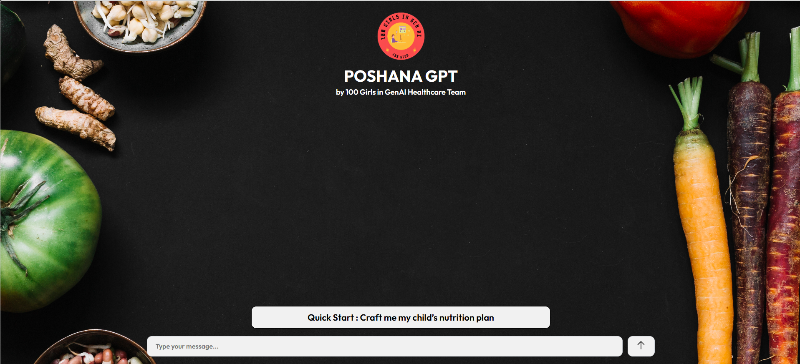

# Healthcare-Chatbot-using-Claude-and-ML

## Description
This is a chatbot designed to assist parents of malnourished or sickly children in obtaining nutritional advice and support. By answering 5-8 simple questions about the child's diet, environment, and financial capacity, the chatbot provides:

1. A preliminary diagnosis and personalized diet plan to help improve the child’s condition (if reversible without a doctor's assistance).
2. Recommendations for nearby doctors if the condition appears too severe (based on the user's location).

This project leverages Claude's advanced AI capabilities along with machine learning to deliver efficient and accurate recommendations.

---

## Features
- **Simplified Questionnaires**: Easy-to-answer questions for a quick assessment.
- **Diet Recommendations**: Personalized diet plans based on the child's needs and household constraints.
- **Doctor Locator**: Suggests nearby healthcare professionals in severe cases.
- **User-Friendly Web App**: Intuitive and responsive design for seamless interactions.

---

## Tech Stack
- **Frontend**: ReactJS
- **Backend**: NodeJS
- **Machine Learning**: Python
- **API**: Claude API

---

## Installation and Setup

1. Clone the repository:
   ```bash
   git clone https://github.com/your-username/Healthcare-Chatbot-using-Claude-and-ML.git
   ```
2. Navigate to the project directory:
   ```bash
   cd Healthcare-Chatbot-using-Claude-and-ML
   ```
3. Install dependencies for the frontend:
   ```bash
   cd frontend
   npm install
   ```
4. Install dependencies for the backend:
   ```bash
   cd ../backend
   npm install
   ```
5. Set up the Python ML environment:
   ```bash
   cd ../ml
   pip install -r requirements.txt
   ```
6. Add your Claude API key in the `.env` file in the backend folder:
   ```plaintext
   CLAUDE_API_KEY=your_api_key
   ```
7. Start the services:
   - Frontend:
     ```bash
     cd frontend
     npm start
     ```
   - Backend:
     ```bash
     cd ../backend
     npm start
     ```
   - ML Server:
     ```bash
     cd ../ml
     python app.py
     ```

---

## Screenshots


*Home page of the chatbot web app*

## Contributing
Contributions are welcome! Please open an issue or submit a pull request with your ideas or improvements.

---

## License
This project is licensed under the MIT License. See the `LICENSE` file for details.
